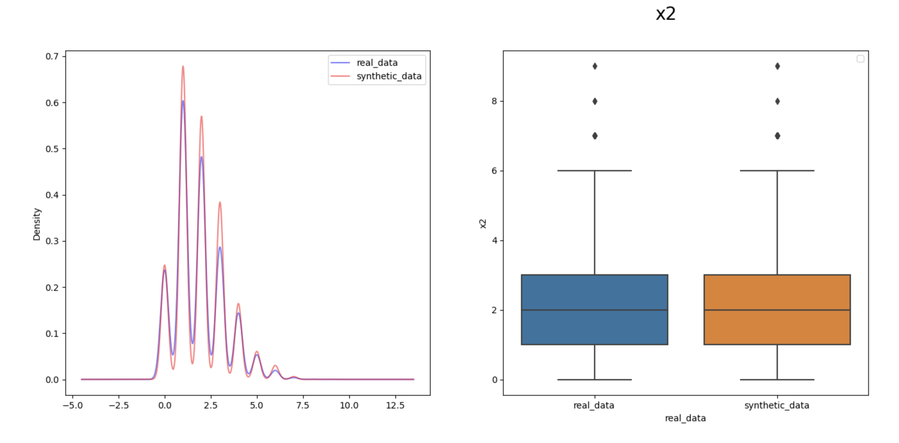
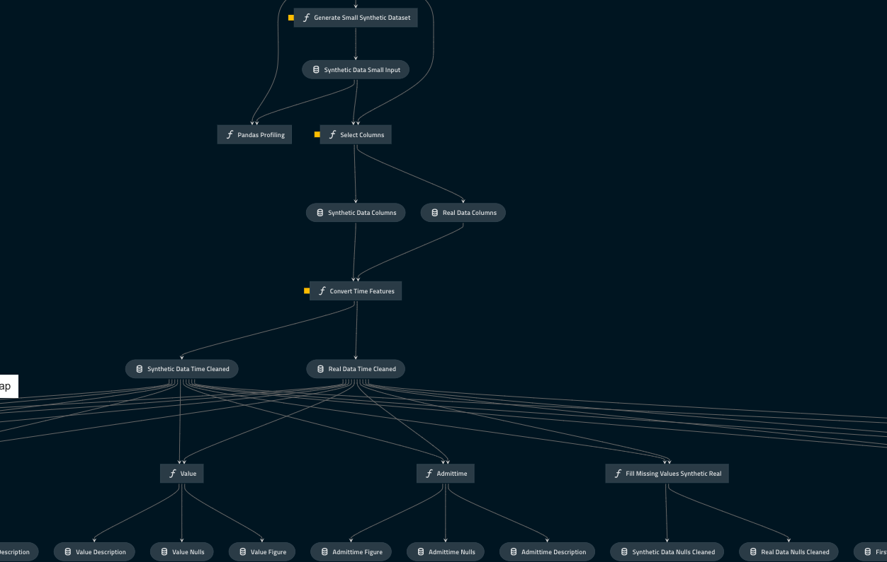

# NHS AI Lab Skunkworks project: Synthetic Data Generation

> A exploratory project for the NHS AI (Artificial Intelligence) Lab Skunkworks team, Synthetic Data Generation explores practical application of synthetic data generation methods of datasets with mixed column types

Synthetic Data Generation was taken on to explore how synthetic data generation methods can be used in reality, looking at how they can be applied and how well they perform. The primary purpose of this project was to deliver a set of synthetic data sources and a pipeline for their generation and evaluation for use by the NHSX Analytics Unit. The project ran from December 2021 to April 2022.

## Background

There are many ways to generate synthetic data, as well as many metrics by which to judge the output. This project seeks to explore the options available, including SynthVAE, a model produced by NHSX through the PhD Internship program in the NHSX Analytics Unit. This project also explores the metrics available to assess synthetic data. Finally, the NHSX Analytics Unit had a business requirement for some synthetic datasets, including the methodology and architecture used to generate them, which this project also seeks to provide.

An overview of the approaches and challenges with generating synthetic datas can be seen in [Synthetic Data in Health](https://nhsx.github.io/AnalyticsUnit/synthetic.html) written by NHS Transformation Directorate's Analytics Unit.

This model builds on the SynthVAE model, built by NHS Transformation Directorate's Analytics Unit. The code is open-source and can be seen at the [original repository](https://github.com/nhsx/SynthVAE).

This project utilises MIMIC-III data, a deidentified health-related data associated with over forty thousand patients who stayed in critical care units of the Beth Israel Deaconess Medical Center between 2001 and 2012. More information on the dataset is available at https://physionet.org/content/mimiciii/1.4/.

## Under development

This project is currently under active development, with updates being merged directly into `main` from a branch where development takes place.

## Documentation:

| Docs | Description |
| ---- | ----------- |
| [SynthVAE](docs/SynthVAE_README.md) | SynthVAE Repo documentation, including details of new files added under this project which generate datasets using MIMIC-III data and PyCox Support data. See this document for more around the changes made to SynthVAE for MIMIC-III |
| [MIMIC Data Preprocessing](docs/mimic_data_preproc.md) | Details of MIMIC-III preprocessing to obtain input file |
| [Synthetic Dataset Evaluation](docs/synthetic_data_eval.md) | Details of evaluation metrics used |

## Known limitations

* The SDV evaluation function can take a very long time to run for large files
* SDV evaluation metrics which utilise components from Scikit-Learn are not reproducible (as the random state is not set by SDV)
* SynthVAE has been updated specifically for MIMIC-III. Read more about the changes [here](docs/SynthVAE_README.md#usage). Other changes may be needed for different datasets
* Note that the version of SynthVAE used here is a static copy of the [original repo](https://github.com/nhsx/SynthVAE). Any updates, changes or improvements made to the model in that repo will not be reflected in this repo.

## Getting Started

* This project requires Python 3.8.8

* To use the preprocessing pipeline as currently written, you will need access to [MIMIC-III data](https://physionet.org/content/mimiciii/1.4/)

### Installation

1. Create a virtual environment using e.g. [venv](https://docs.python.org/3/library/venv.html)
2. Install the required packages e.g. with venv call `pip install -r src/requirements.txt` while in the `skunkworks-synthetic-data` folder once the virtual environment is active

### Running the pipelines

With the virtual environment active, calling `kedro run` will run the default pipeline which is `small_end_to_end` in this version.

To run a specific pipeline call `kedro run --pipeline [pipeline_name]`. The pipelines available can be found in [pipeline_registry.py](src/skunkworks_synthetic_data/pipeline_registry.py).

The pipeline you wish to use will depend on what you want to achieve using the pipeline:
| Pipeline type | Description | 
| ------------- | ----------- | 
|`[size]_preproc_pipeline`| Generates a pre-processed version of the MIMIC-III input file (`[size]` can be replaced with either small (11040 rows), medium (81795 rows), or large (217010 rows)). This type of pipeline will not generate any synthetic data, it will just construct an input file. |
| `[size]_synthetic_generation_pipeline` |  Trains a SynthVAE model on the corresponding MIMIC-III input file (again `[size]` can be replaced with any of small (11040 rows), medium (81795 rows), or large (217010 rows)). The corresponding `[size]_preproc_pipeline` should be run before hand so the input file exists. This pipeline takes the input file, trains a model, and generates synthetic data with the trained model. |
| `[size]_data_evaluation_pipeline` | Runs a set of evaluation checks on the original and synthetic datasets. `[size]` can be replaced with any of small (11040 rows), medium (81795 rows), or large (217010 rows). For this to run, at least one of the `[size]_synthetic_generation_pipeline` will need to have been run so that a synthetic dataset is present to analyse. |
| `[size]_end_to_end` | Ties together `[size]_preproc_pipeline`, `[size]_synthetic_generation_pipeline` and `[size]_data_evaluation_pipeline` in one run. This is what you should run if you want to see how the whole process works, and what the entire process outputs. |
| `support_demo_pipeline` | Runs an `end_to_end` pipeline using PyCox Support data. This demonstrates how the whole process works without needing to input your own data source |

An example of the pipeline structure can be seen below:

### Running an example

If you do not or cannot obtain access to MIMIC-III data, this section is intended to show you how the functionality works, leveraging a fully open dataset from Pycox called SUPPORT.
#### Using Pycox SUPPORT data

To run the Pycox SUPPORT example, once you have activated your virtual environment and installed the requirements, you call the following in command line or Powershell:
`kedro run --pipeline support_demo_pipeline`

Once this has run, the synthetic data will be saved in `data/07_model_output` and it will be named according to the size of input data used. Three reports will be saved in `data/08_reporting`:
- `data_checks.html` - this contains all of the comparison metrics between the two data sets
- `real_data_profile.html` - this contains the Pandas-Profiling report for the real input data
- `synthetic_data_profile.html` - this contains the Pandas-Profiling report for the synthetic input data

### Visualising pipelines

Kedro provides a useful piece of functionality to visualise your pipelines once created. Using the package `kedro-viz` (installed as part of this project), you can visualise your pipelines in your web browser.

Once you've installed all of your packages, run `kedro viz` from the `skunkworks-synthetic-data` folder

### How do I adapt this for my use?

This repository serves to demonstrate how synthetic data generation models and pipelines can be used to enable interchangeable generation and evaluation of synthetic data.

In order to adapt this project for your own use, there are a number of key files that changes will need to be made to:

| File | Description | What needs to be changed in these files | Kedro docs |
| ---- | ----------- | --------------------------------------- | ---------- |
| [pipeline_registry.py](src/skunkworks_synthetic_data/pipeline_registry.py) | This file contains all of the Kedro pipeline constructions | Functions describing your own pipelines will need to be added here | [See more here](https://kedro.readthedocs.io/en/stable/nodes_and_pipelines/modular_pipelines.html#what-does-the-kedro-pipeline-create-do)|
| [parameters.yml](conf/base/parameters.yml) | Contains lists of all variables used across Pipeline functions | Any parameters you want to be stored centrally for any of your pipeline functions need to be stored here | [See more here](https://kedro.readthedocs.io/en/stable/get_started/example_project.html#conf) |
| [catalog.yml](conf/base/parameters.yml) | Contains all datasets used and produced by the pipelines and details of where they are stored | Any datasets used or produced by your Pipelines need to be listed here | [See more here](https://kedro.readthedocs.io/en/stable/get_started/example_project.html#conf) | 

For more details on how these files are used, please see the [Kedro documentation](https://kedro.readthedocs.io/en/stable/index.html)

Depending on what your starting point is, you will need to create and/or change a number of files:

| What you have | What needs to be changed |
| ------------- | ------------------------ | 
| You have an input file ready to be used to train a synthetic data model | You will need to create your own version of `[size]_synthetic_generation_pipeline` [found here](src/synthetic_data_generation/pipelines/data_generation_pipeline.py), updating the files used as input. The created pipeline will need to be added to [pipeline_registry.py](src/skunkworks_synthetic_data/pipeline_registry.py) |
| You wish to leverage a different synthetic data generation model | You will need to create your own version of `[size]_synthetic_generation_pipeline` [found here](src/synthetic_data_generation/pipelines/data_generation_pipeline.py), replacing the existing SynthVAE functionality with your selected model. The created pipeline will need to be added to [pipeline_registry.py](src/skunkworks_synthetic_data/pipeline_registry.py) |
| You have new input data and wish to included preprocessing as a step in the pipeline | You will need to create your own version of `[size]_preproc_pipeline` [found here](src/synthetic_data_generation/pipelines/data_generation_pipeline.py), replacing the existing preprocessing functionality. The created pipeline will need to be added to [pipeline_registry.py](src/skunkworks_synthetic_data/pipeline_registry.py) |
| You wish to update the checks applied to the synthetic data | You will need to update our own version of `[size]_data_evaluation_pipeline` [found here](src/synthetic_data_evaluation/pipelines/data_evaluation_pipeline.py). The created pipeline will need to be added to [pipeline_registry.py](src/skunkworks_synthetic_data/pipeline_registry.py) |
| You wish to run the evalulation pipeline for synthetic data you have generated |Add the real and synthetic dataset file paths to the [data catalog](conf/base/catalog.yml) under `custom_real_data` and `custom_synthetic_data` respectfully. Once added run: `kedro run --pipeline custom_data_evaluation_pipeline`. The outputs will be seen [here](data/08_reporting/). More information about the evalulation pipeline can be found [here](src/synthetic_data_evaluation/pipelines/data_evaluation_pipeline.py).
| You wish to run the evalulation checks without using a kedro pipeline |An example notebook demonstrating on how to use the evaluation checks without using a kedro pipeline can be found [here](notebooks\synthetic_data_evalulation.ipynb).
| You wish to run end to end processes using any new pipeline components | You will need to create your own version of `[size]_end_to_end` [found here](src/skunkworks_synthetic_data/pipeline_registry.py) |

## NHS AI Lab Skunkworks
The project is undertaken by the NHS AI Lab Skunkworks, which exists within the NHS AI Lab at NHSX to support the health and care community to rapidly progress ideas from the conceptual stage to a proof of concept.

Find out more about the [NHS AI Lab Skunkworks](https://www.nhsx.nhs.uk/ai-lab/ai-lab-programmes/skunkworks/).
Join our [Virtual Hub](https://future.nhs.uk/connect.ti/system/text/register) to hear more about future problem-sourcing event opportunities.
Get in touch with the Skunkworks team at [aiskunkworks@nhsx.nhs.uk](aiskunkworks@nhsx.nhs.uk).

## Licence

Unless stated otherwise, the codebase is released under [the MIT Licence][mit].
This covers both the codebase and any sample code in the documentation.

The documentation is [© Crown copyright][copyright] and available under the terms
of the [Open Government 3.0][ogl] licence.

[mit]: LICENCE
[copyright]: http://www.nationalarchives.gov.uk/information-management/re-using-public-sector-information/uk-government-licensing-framework/crown-copyright/
[ogl]: http://www.nationalarchives.gov.uk/doc/open-government-licence/version/3/
